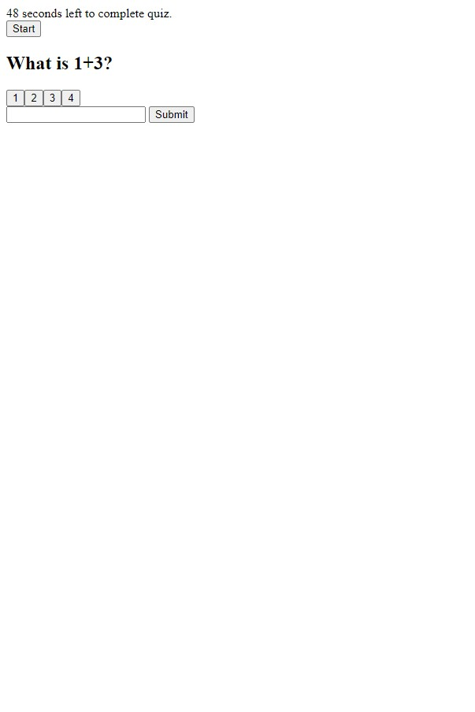

# Timed-Question    

### <u> Description: </u>
This is a simple math quiz that contains 3 questions. When you answer incorrectly it deducts 10 seconds. Total seconds left is the total score.

### <u> Notes: </u>
Initials button is shown at end of 3 question quiz. 

### <u> Screenshot: </u>

  

    
### <u> Deployable Link to Website: </u>

https://myagentortega.github.io/timed-question/

### <u> Support:  </u>

- [MDN](https://developer.mozilla.org/en-US/)  

- [Google](https://Google.com)

### <u> Contact: </u>

- [Contact - Future Coder - Joseph S. Ortega](mailto:MyAgentOrtega@gmail.com)

### <u> Acknowledgement </u>

Authors and acknowledgement: Thank you to all my peers, tutors and instructors that helped me along the way!

### <u> License </u>

